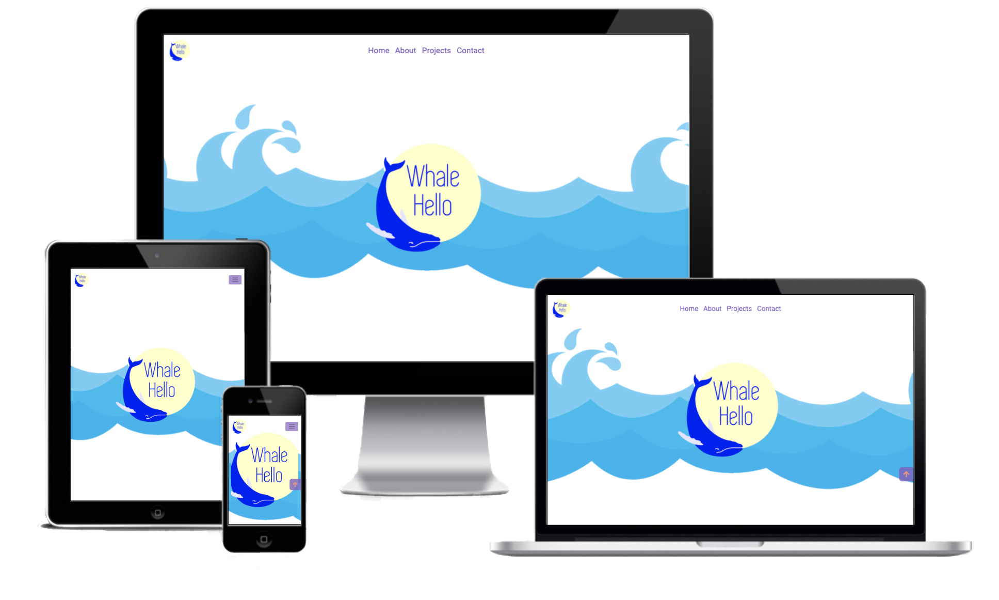

# Milestone Project 1

## Whale Hello

## Project

The use will be to display and advertise the services offered by a Videographer/Photographer/Animator/Editor. The site will show previous projects undertaken as well as the services they are offer. The site will container all contact information as well as links to social media.

# Showcase

A deployed link to the site can be found [here](https://cod182.github.io/Milestone-Project-1/)

# UX

## User Story

The end user is someone who is looking to hire a Videographer/Photographer/Animator/Editor to undertake a project for them. The site would be aimed at small businesses, local and nation wide.The site will mainly be accessed on mobile devices due to the current trend, but will be designed for desktop also.

The end user will want to see previous projects that that been undertaken and an average cost of the service. There will be a contact form with required the information of type fo projects project and description.

Information must be clearly displayed and accessible. The colour scheme will be bright and clean with the photography work integrated through some sections.

Embedded video will be available on project pages where applicable.

## Strategy

### User Needs

- The user needs the site to be accessible mainly on mobile device but equally on tablets and desktops. 
- Information must be easy to access, clearly displayed and easy to digest.

Technical Capabilities

- It is possible to create this site efficiently using the bootstrap framework and HTML/CSS that I have learned.

### Business Vision

- The business wants to advertise their work and gain new clientele in order to grow. 
- The site needs to clearly show all important work and let people contact them easily. 
- The site must remain professional and simply to use.

## Scope

- The site will include information about the company, their goals and ethos and their previous work. T
- here will be easily accessible previous work  to show the skillset of the company. 
- If the user is happy with what they see, they are able to get in contact to enquire about working on a project and can also share the work.

## Structure

- The structure will be a single landing page, containing an about section, latest projects section and contact section, there will also be links to full archive of projects.
- The flow of the landing page will being with the company logo at full height, below this there will be an about section introducing the company, giving information about them and their ethos. 
- This is then followed by latest projects showing their latest work, there will be links to another page to view the full project archive contains videos and descriptions. 
- Finally there will be a contact section that will allow users to get in touch to enquire about working on a project.

## Skeleton

### Wireframes

Wireframes were created at the start of the project [Original Wireframes](readme/wireframes/original-wireframes). These were updated [New Wireframes](readme/wireframes/new-wireframes) during the project as the design was altered during creation.

#### Original Wireframes
- [XS >576px](readme/wireframes/new-wireframes/xs-width-_576px(375px).png)
- [SM ≥576px](readme/wireframes/original-wireframes/sm-width-≥576px.png)
- [MD ≥768px](readme/wireframes/original-wireframes/md-width-≥768px.png)
- [LG ≥992px](readme/wireframes/original-wireframes/lg-width-≥992px.png)
- [XXL ≥1400px](readme/wireframes/original-wireframes/xxl-width-≥1400px.png)

#### New Wireframes
- [XS >576px](readme/wireframes/new-wireframes/xs-width-_576px375px.png)
- [SM ≥576px](readme/wireframes/new-wireframes/sm-width-≥576px.png)
- [MD ≥768px](readme/wireframes/new-wireframes/md-width-≥768px.png)
- [LG ≥992px](readme/wireframes/new-wireframes/lg-width-≥992px.png)
- [XXL ≥1400px](readme/wireframes/new-wireframes/xxl-width-≥1400px.png)

## Surface

The finished site will be a single page introducing the company, and showing their work.

### Home
The home page will contain a Navbar along the top that will shrink on tablets and mobile. It will also containt an full height hero image of the companies logo.

### About
The about seciton wil have an image background. The section will contain an introducton section on the left with a skills pane, on the right there will ba overview video. Below these there will be testimonials from clients. On mobile the elements will bee full width and stacked.

### Latest Projects
The latest projects section will display the latest projects from each aspect of the company. There will also be link to archive pages for each of the project caracories.

### Contact
The contact section will be have a solid background. To the left will be an animated gif and to the right will be a contact form. The contact form will allow a prospective lient to enter required details and send a message to the company.

### Archive Pages
Each catagories page will be similar. There will be a number of projects displayed will relevant information on each. There will be a favourite projects section that will contain 3 projects. Below this there will be a Archived Projects section containing an unlimited number of projects.

  
The colours to be using on the page are a contrasting purple and orange.
The fonts to be used on the site are Roboto and Lato.

Visual Design
	Colours, typography, effects, imagery
	Reinforce the content
	Guide the user through tasks and information
	Minimise cognative overload. Max intuitive learning
	Appropriate content
	Final Design

## Features

### Existing Features

- HTML5 video played in background of about section. Autoplay, muted and on loop
- Archive pages with modals on each project

### Features to be implemented

- Mailing List sign up for project updates
- Top of page button only appearing after hero image
- Breakdown of gerneral costs for each service
- Mail server connection for contact form

## Technoogies used
- HTML5
- CSS3
- Javascript
- Bootstrap v5 beta 2
- Hover 2.3.1
- Google Chrome Dev tools for debugging
- Google Lighthouse for audits

# Testing

## Planning

At the beginning of the project I was aware of the audience for the website and their needs when visiting. I considered the devices that would be used when visiting and took note of ensuring the pages looked their best when visited.

The devices I plan to test the websit with are:

- Chrome Developer Tools
    - iPhone 5/SE (320x568)
    - iPhone 6/7/8 (357x667)
    - iPhone 6/7/8 Plus (414x736)
    - iPad (768x1024)
    - iPad Pro (1024x1366)

- Handheld Device Realworld Testing
    - iPhone XS Max
    - iPhone 12
    - iPad Pro 11"
    - Samsung Galaxy A40

- Screen Testing
    - Laptop Screen 13" (1280x800)
        - Safari
        - Chrome
    - Laptop Screen 16" (3072x1920)
        - Safari
        - Chrome
    - Desktop Screen 22" (1680 × 1050)
        - Safari
        - Chrome
    - iMac 5K Screen 27" (5120x2880)
        - Safari
        - Chrome
---

## Running Tests

During the testing processed I used Chrome Developed tools whenever an issue was discovered. This ensured the issues could be resolved before editing my html files.
Validators were used to pick up any issues with the code, where a problem was discovered, it was resolved and re-tested until no issues were discovered.
Google Lighthouse was then used to check the Perormance, Accesability, Best Practices and SEO levels. When issues were discovered that we causing scores to drop, html & css was edited in Chrome Developer Tools to ensure the resoltion worked, then commited in my html files. This was repeated until scores were at an accepable level.

### HTML5 
The code was validated using [W3C Markup Validation Service](https://validator.w3.org/#validate_by_input)

|Page|Result|Resolution|
|----------|------|---|
|index.html|Error found on contact form method & action|method assigned to get & action given a holder of URL as no backend yet
|photography.html|Error found on contact form method & action|method assigned to get & action given a holder of URL as no backend yet
|animation.html|Error found on contact form method & action|method assigned to get & action given a holder of URL as no backend yet
|editing.html|Error found on contact form method & action / aria-abelledby errors on modals|method assigned to get & action given a holder of URL as no backend yet / removed aria-labelledby
|videography.html|Error found on contact form method & action|method assigned to get & action given a holder of URL as no backend yet
|404.html|Stray /head tag found|Removed unused /head tag

### CSS3 
The code was validated using [W3C CSS Validation Service](https://jigsaw.w3.org/css-validator/#validate_by_input)

No Errors Found

All pages were testing with Google Dev Tools Lighthouse first to identify and issues before testing.
Issues with page load times were identified and solved. The first issues related to the .gif that played in the contact section. This was converted to a .webm and played throuhg a HTML5 video element. 
The second issue related to large image thumbnails for projects. Thiswas resolved by using the picture element over the img and providing a different src for desktops and mobiles. These 2 fixes increased the page load times vastly.
Results of the [Lighthouse tests can be found here](readme/wireframes/testing.md)

The full process for testing the site can be found here [Testing Logs](readme/testing.md). The processes to pass were:

|Page|Test|Result|
|---|---|---|
|index.html|Page Load Quickly|Pass/Fail|
|index.html|About Link Works|Pass/Fail|
|index.html|About Video Plays|Pass/Fail|
|index.html|Home Link Works|Pass/Fail|
|index.html|Project Link Works|Pass/Fail|
|index.html|Latest Project Cards Flip|Pass/Fail|
|index.html|Modal Opens/Closes|Pass/Fail|
|index.html|Top of Page Button Works|Pass/Fail|
|index.html|Contact Link Works|Pass/Fail|
|index.html|Contact Form Works|Pass/Fail|
|index.html|Brand Icon Link Works|Pass/Fail|
|index.html|Animation Page Link Works|Pass/Fail|
|animation.html|Thumbnail Shakes on hover|Pass/Fail|
|animation.html|Modal Opens|Pass/Fail|
|animation.html|Video Plays|Pass/Fail|
|animation.html|Videos stops when Modal Closed|Pass/Fail|
|animation.html|Contact Link Works|Pass/Fail|
|animation.html|Brand Link Works|Pass/Fail|
|animation|About Link Works|Pass/Fail|
|editing.html|Thumbnail Shakes on hover|Pass/Fail|
|editing.html|Modal Opens|Pass/Fail|
|editing.html|Video Plays|Pass/Fail|
|editing.html|Videos stops when Modal Closed|Pass/Fail|
|editing.html|Contact Link Works|Pass/Fail|
|editing.html|Brand Link Works|Pass/Fail|
|editing|About Link Works|Pass/Fail|
|photography.html|Thumbnail Shakes on hover|Pass/Fail|
|photography.html|Modal Opens|Pass/Fail|
|photography.html|Video Plays|Pass/Fail|
|photography.html|Videos stops when Modal Closed|Pass/Fail|
|photography.html|Contact Link Works|Pass/Fail|
|photography.html|Brand Link Works|Pass/Fail|
|photography|About Link Works|Pass/Fail|
|videography.html|Thumbnail Shakes on hover|Pass/Fail|
|videography.html|Modal Opens|Pass/Fail|
|videography.html|Video Plays|Pass/Fail|
|videography.html|Videos stops when Modal Closed|Pass/Fail|
|videography.html|Contact Link Works|Pass/Fail|
|videography.html|Brand Link Works|Pass/Fail|
|videography|About Link Works|Pass/Fail|
|404.html|Head Home Button Works|Pass/Fail|

## Testing Results

Testing process has been logged on a seperate readme file file found here: [Testing Logs](readme/wireframes/testing.md)

The overall results was good, with a few bugs found. These were resolved by using Chrome Developer Tools first, helping find the issues quickly and ensuring the intend fix worked. It would then be implemented in html files.

Loading times on desktop sites were good to start with but mobile sites had overally network load issues. This has to be resolved using a src set on pictures, this resolved the oading issue son mobiles and improved the performace score greatly.

I did discover that an error page would be required incase someone typed a page url incorrectly. This was quickly set-up and impletmend. It can be viewed here: [404 Page](404.html).
The 404 page was also then included in all testing to ensure it was working correctly.

### Bugs that occured
- When a modal was opened and a video played, the video would not stop when the modal was closed. Creating a bad user experience as the user would need to find teh same modal and stop the video.
    - The resolution to this was complex for me at this point in learning as I have no experiecne of jvascript. Reaching out, I found someone who helped assist me through the process of using vanilla javascript.
    - The modal closebutton was captured and on click it would remove then add the youtube video src, causing the video to stop, but still be availabe if the modal was re-visited.
    - For HTML5 video players the modal close button would cause the video to pause.
- When in mobile view, the nav bar would not collapse when a link was clicked that pointed to an anchor on the same page. This created a bad user experience as the user would need to close the nav manuallt. 
    - This was resolved by searching for a vanilla javascript was to capture the link click action and add add collapsed to the navbar-sm-dropdown class.
- Clipping to hero-image on mobile devices
    - This was resolved by changing the background size from auto to contain for screens sizes lower than 414px
- Text on testimonials was too large
    - Resized with a media query
- Image thumbnails on videography.html were broken
    - paths were corrected
- Button on animation card of index.html stuck out of the bottom 
    - Added to existing media query .latest-height to 70% width
- Modal images overlapping on the bottom of each image
    -   Changed the height on img-gal to 80%
- On iPhones about-video & contact-bg did not play
    - Added playsinline to class of video
- On iphone the about-bg video had black bars around it
    -re-sized video with custom resolution
- contact-bg-video broken on mobile
    - corrected path
- hero-bg did not span whole width of page on larger screens
    - background-size changed to cover
- contact-video was rendering with black squares on it
    -resolution of video was too high, re-sized to lower resolution
- Message box on contact on index.html was not using a placeholder for text causing text not to disappear when clicked.
    - Placeholder added

    All of the bugs that cropped up helped me with the debuggin processed, as I had not debugged html/css before. The chrome Developer tools were used greatly in this processed to ensure the root cause of the problem was located and the fix issued before editing my html pages.
## Deployment

The project is hosted in GitHub and built in GitPod.

The desployed site is hosted on GitHub Pages and can be viewd here : https://cod182.github.io/Milestone-Project-1/
This was executed by:
- Got to the Milestone-project-1 Repo
- Clicking on Settings
- Clicking on Pages
- Selecting master from sources
- Clicking save

The site was the made avaiable at the above url.

 To clone the project:

- Go [Here](https://github.com/cod182/Milestone-Project-1)
- Click Code
- Choose either
    - Open with GitHub Desktop
    - Download as Zip
- You can now open the project in a IDE or host to a server

## Bugs/Changes During Development

During the process of building the site I came across a few issues that were down to my html structur causing my css code not to take effect as I expected.
I had issues with all my sections where the text content would not expand the background image. This was due to the was I had structured my html. Once I had used Chrome Developer Tools to make some on the fly adjustment I was able to sucsussfully get the background images and text content to work as expected.

There was an issued with the archive pages where the videos and images would not display at the correct size, despite the sizes being set on the classes in css. After searching in Chrome Developer Tools it was found that class has a missing s and as the modals had been duplicated for multiple projects, none were getting the effects from the css. Once this was adjust for one image in a moda sucsussfully, the spelling correction was mad to all affected areas and the issues was resolved.

It was decided during the development processed that as the site was and company was aimed toward video content, it would be a good idea to have a video backgroudn to the aboiut section. This was implemented in a new wireframe and added to the site using a html5 video autoplaying and muted in the background. It was chosed to keep it muted as it would be bad ux to have sound playing when you load a site. It was also then decided to have the main abobut conent on a seperate section os the bulk of the video was viewable.

When it was discovered that videos did not stop playing when a modal was closed, I needed to find a way to stop them. I knew that the close modal button needed to be used to stop the video and javascript would be required, but did not have the experience. After attempting to use other answers from google, I reached out to an industry exper who guided me through the process of capturing the button click and capturing the src of the videos. Although I did no write the code myself, it threw me into he world of vanilla javascript. Credited the industry expert in credits section. JB

The nav was found not to collapse when a link was clicked while mobile. As i had be somewher introduced to javascript I attempted to capture the button click and remove the show class from the nav's div. I did have to search on stackoverflow to find how others were attempting this and managed to find a way to get it working. This may not be perfect, but given my lack of current knowledge  with javascript, it did cause the nav to be collapsed when a link was clicked.

# Credits

- Media
    - Whale Hello provided 99% of images and video
    - vippng.com provided the waves image on index.html [Link To Site](https://www.vippng.com/maxp/bxbwRm/)
    - Mi Little Pad, Kids With Bricks and Cardiff Canine Citizens provided their logos for use on the site.

- Fonts
    - Google Fonts provided the roboto and lato fonts [Link To Site](https://fonts.google.com/)

- Icons
    - Fontawesome provided all the icons used. [Link To Site](https://fontawesome.com/)

- Modal
    - The start of the modal was provided by bootstrap and then built upon

- Image Flip bord on index.html
    - Codepen.io user Jeet provided an template card flip that was expanded upon to fulfil the sites needs [Link To Site](https://codepen.io/JEETPAL/details/ZMvwjV)     

- Video Background
    - W3Schools [Link To Site](https://www.w3schools.com/howto/tryit.asp?filename=tryhow_css_fullscreen_video)
    - Video not playing on mobile [Rob Simpson](https://robsimpson.digital/articles/autoplay-html5-video)

- Tutorials
    - WebDesign provided tutorials for creating verticle text [Link To Site](https://webdesign.tutsplus.com/)

- Javascript
    - James Bainbridge (Provided assistance in creating a script to stop videos playing when the modal was closed)
    - Stackoverflow (Porvided guidance toward closing of nav bar when link was clicked)

- General Information
    - User nemixu gave a highly informative talk on the project requirments.

---
## This project is for educational purposes only

### Created by Codie Stephens-Evans